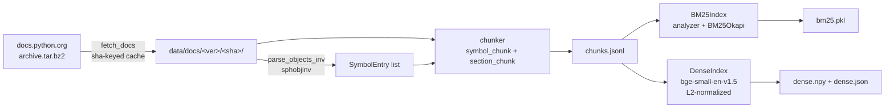
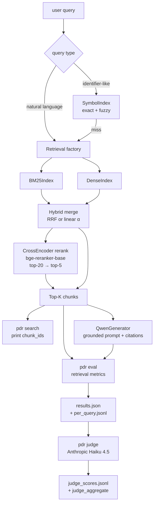

# python-doc-assistant

A Python documentation RAG assistant built from scratch — pinned corpus,
12-configuration retrieval ablation, grounded generation with citations,
and a kappa-calibrated LLM-as-judge for answer-quality evaluation. Every
eval run is replayable bit-for-bit against the same corpus.

**v0** retrieval baseline → **v1** grounded `Qwen2.5-1.5B-Instruct`
generation → **v2** dense / hybrid / rerank ablation + LLM-as-judge.
All three stages complete with narrative, run snapshots, and a 663-row
judge dataset.

## Headline results

`eval_sets/v2_full.jsonl`, n=111 queries; generator =
`Qwen/Qwen2.5-1.5B-Instruct`; judge = `claude-haiku-4-5-20251001`,
prompt hash `65fa23b9`.

| Configuration | Recall@5 | accuracy | halluc | correct |
|---|---:|---:|---:|---:|
| `symbol+bm25` (v0 baseline)   | 0.730 | 61.3% | 25.2% | 18.9% |
| `dense`                       | 0.811 | 67.9% | **21.1%** | 11.0% |
| `hybrid-rrf`                  | 0.775 | 67.6% | 21.6% | 16.2% |
| `hybrid-linear α=0.3`         | 0.802 | **69.1%** | 22.7% | 12.7% |
| `hybrid-rrf + rerank`         | 0.829 | 66.7% | 21.6% | 8.1% |
| `dense + rerank`              | **0.838** | 68.5% | 21.6% | 6.3% |

`accuracy = (correct + partial) / n`. **Bold** = best in column.

## Three findings worth noting

1. **Retrieval and generation winners diverge.** Best Recall@5 is
   `dense+rerank` (0.838); best accuracy is `hybrid-linear α=0.3`
   (69.1%); best correct_rate is `symbol+bm25` (18.9% — the v0
   baseline). The retrieval winner is not the answer-quality winner.
2. **Hallucination clusters at 21-23% across all 5 dense / hybrid
   configs.** Switching retrieval algorithm barely moves
   hallucination on a 1.5B Qwen — a strong signal that the
   generation-side ceiling, not retrieval, is the next bottleneck.
3. **Rerank delivers +2.7 pp Recall@5 but 0 pp accuracy.** Cross-encoder
   reordering elevates broader section_chunks; the 1.5B model then
   prefers them over precise symbol_chunks. correct_rate even *drops*
   −4.7 pp on `dense → dense+rerank`. The retrieval benchmark wins
   are real; they just don't translate into answer-quality wins at
   this generator size.

Full ablation table, narrative, and v3 priority recommendation:
[`experiments/v2-ablation.md`](experiments/v2-ablation.md). Per-stage
narratives:
[`experiments/v0-bm25-only.md`](experiments/v0-bm25-only.md),
[`experiments/v1-qwen-grounded.md`](experiments/v1-qwen-grounded.md).

---

## Why these decisions

**Pin the corpus by sha.** The Python docs archive is downloaded once
under `data/docs/<version>/<sha_short>/` and `pdr ingest` errors out on
any sha mismatch. Every `results.json` snapshots the full ingest
manifest. An eval run from week 1 always replays against the exact
same chunks, embeddings, and BM25 index it was measured against — no
silent corpus drift, no "the docs site updated" excuses.

**Build an ablation matrix, not a single config.** v2 runs 12 retrieval
configurations on the same 111-query eval set: BM25 / symbol+BM25 /
dense / hybrid-RRF / hybrid-linear at 5 α values / *+rerank pairs.
That's how the surprising findings above surface. A "best config"
single-shot would never reveal that rerank fails to help generation.

**LLM-as-judge with kappa-calibrated agreement, not vibes.** v2 §6
inter-rater agreement check on 15 stratified samples vs. manual scores
yields exact-match 73.3% / Cohen's kappa 0.645 (substantial agreement,
not the 80% rule-of-thumb plan bar but defensible for delta analysis).
Methodology + four-tier rubric documented; deltas across configs use
the same systematically-biased judge so cross-config comparisons stay
valid even if absolute numbers shift.

---

## Quick start

```bash
# v0 install: ingest + retrieval, no torch
uv sync --extra dev --extra ingest --extra retrieval

# Download Python 3.12 docs archive (~50 MB, sha-keyed cache)
uv run pdr ingest --version 3.12

# Parse symbols + chunk HTML + persist chunks.jsonl + bm25.pkl
uv run pdr build-index

# Search (v0 retrieval)
uv run pdr search "Path.read_text" --k 5
uv run pdr search "how to iterate dict safely" --k 5 --debug

# v0 retrieval-only eval
uv run pdr eval --set eval_sets/v0_core.jsonl --tag v0-bm25
```

For v1 (grounded generation) and v2 (dense / hybrid / rerank):

```bash
# v1+ install: add generation, embedding, rerank, judge extras
uv sync --extra dev --extra ingest --extra retrieval \
  --extra generation --extra embedding --extra rerank --extra judge

# Build dense embedding index (sentence-transformers, BAAI/bge-small-en-v1.5)
uv run pdr build-index --with-dense

# v2 retrieval ablation (12 configs against v2_full)
uv run pdr eval --set eval_sets/v2_full.jsonl --retriever symbol+bm25 --tag v2-bm25
uv run pdr eval --set eval_sets/v2_full.jsonl --retriever dense --tag v2-dense
uv run pdr eval --set eval_sets/v2_full.jsonl --retriever hybrid-rrf --tag v2-hybrid-rrf
uv run pdr eval --set eval_sets/v2_full.jsonl --retriever hybrid-linear --alpha 0.3 --tag v2-a03
uv run pdr eval --set eval_sets/v2_full.jsonl --retriever dense --rerank --tag v2-dense-rerank

# v1/v2 generation: layer Qwen2.5-1.5B-Instruct grounded prompt on top of any retriever
uv run pdr eval --set eval_sets/v2_full.jsonl --retriever dense --rerank \
  --model Qwen/Qwen2.5-1.5B-Instruct --tag v2-dense-rerank-qwen

# v2 §6 LLM-as-judge (requires ANTHROPIC_API_KEY)
uv run pdr judge --run-dir experiments/runs/<timestamp>-v2-dense-rerank-qwen
```

---

## Architecture

### Build-time pipeline (`pdr ingest` + `pdr build-index`)



### Query-time pipeline (`pdr search`, `pdr eval`, `pdr judge`)



Every artifact (docs / chunks / indexes / eval runs) is keyed by docs
`major.minor` + archive `sha256` short, so old eval runs always replay
against the exact corpus they were measured against.

---

## Tools and libraries

| Layer | Choice | Why |
| ----- | ------ | --- |
| Dependency manager | [`uv`](https://github.com/astral-sh/uv) + `pyproject.toml` + `uv.lock` | Reproducible environments without `requirements.txt`. |
| Build backend | `hatchling` | PEP 621 compliant, src-layout friendly. |
| CLI | `click` | Standard, composable subcommand pattern. |
| HTML parsing | `beautifulsoup4` + `lxml` | Proven, fast, predictable. |
| Sphinx inventory | `sphobjinv` | Reads `objects.inv` symbol → URI maps cleanly. |
| HTTP | `requests` | Streaming download with retry. |
| BM25 | `rank_bm25` | Lightweight, no Elasticsearch dependency. |
| Fuzzy matching | `rapidfuzz` | C-backed `fuzz.ratio` for SymbolIndex.fuzzy. |
| Dense embedding | `sentence-transformers` (`BAAI/bge-small-en-v1.5`, 384-dim) | v2 §1; L2-normalized, cosine == inner product. |
| Cross-encoder reranker | `sentence-transformers.CrossEncoder` (`BAAI/bge-reranker-base`) | v2 §3; top-20 → top-5 rerank. |
| Generation backend | `transformers` (`Qwen/Qwen2.5-1.5B-Instruct`) on Mac MPS | v1 §2; greedy decoding, max_new_tokens=512. |
| LLM-as-judge | `anthropic` (`claude-haiku-4-5-20251001`) | v2 §6; 4-tier rubric + Cohen's kappa. |
| Lint + format | `ruff` (E / F / I rules) | Replaces black + isort + flake8. |
| Type checking | `mypy --strict` | Catches API drift early; `py.typed` marker for downstream consumers. |
| Test runner | `pytest` (+ `CliRunner` for CLI tests) | Hermetic; no real network. |
| Optional extras | `pyproject.toml` extras: `ingest`, `retrieval`, `generation`, `embedding`, `rerank` | v0 installs only `ingest` + `retrieval`; later stages opt-in. |

---

## Stage roadmap

| Stage | Deliverable | Plan | Status |
| ----- | ----------- | ---- | ------ |
| **v0** | Retrieval + evaluation: ingest, chunker, BM25 + symbol index, router, CLI, eval set, metrics, run writer | [`plans/v0-retrieval-eval.md`](plans/v0-retrieval-eval.md) | ✅ Recall@5 = 0.730 on `symbol+bm25` (n=111) |
| **v1** | `Qwen2.5-1.5B-Instruct` as a grounded generator with citations + refusal; out-of-scope eval set | [`plans/v1-qwen-generator.md`](plans/v1-qwen-generator.md) | ✅ Grounded prompt + 4-tier scoring shipped |
| **v2** | Ablation: dense embeddings + hybrid (RRF / linear) + cross-encoder rerank, eval set scaled to 111 queries, LLM-as-judge with kappa-calibrated rubric | [`plans/v2-ablation.md`](plans/v2-ablation.md) | ✅ Recall@5 = 0.838 on `dense+rerank`; accuracy 61-69% across 6 generation configs; halluc 21-25% |
| **v3** | (Research side track) Hand-written decoder-only LLM (RoPE / RMSNorm / SwiGLU / KV cache) plugged into the same RAG pipeline as a comparison backend | [`plans/v3-tiny-llm.md`](plans/v3-tiny-llm.md) | Research; no accuracy claim — learning value only |

Top-level project plan: [`PLAN.md`](PLAN.md). Per-stage plans are the
authoritative source for sub-task ordering, acceptance criteria, and
deliverables.

---

## Repository layout

```
python-doc-assistant/
├── PLAN.md                         # Top-level project plan
├── AGENTS.md                       # Cross-agent rules (Codex / Claude)
├── CLAUDE.md                       # Claude-specific guidance
├── README.md                       # this file
├── pyproject.toml                  # deps + tool config
├── uv.lock                         # pinned versions
├── config.toml                     # DOCS_VERSION = "3.12"
├── plans/                          # per-stage plans
├── eval_sets/
│   ├── v0_core.jsonl               # 34 hand-written queries (v0)
│   ├── v1_out_of_scope_20.jsonl    # 20 OOS queries (v1)
│   └── v2_full.jsonl               # 111 queries (v0_core + 77 new for v2)
├── experiments/
│   ├── v0-bm25-only.md             # v0 narrative
│   ├── v1-qwen-grounded.md         # v1 narrative
│   ├── v2-ablation.md              # v2 narrative
│   └── runs/<ts>-<tag>/            # machine-readable run snapshots
├── data/                           # gitignored: docs / chunks / indexes
└── src/python_doc_assistant/
    ├── ingest/
    │   ├── fetch_docs.py           # download + sha-key + manifest
    │   ├── parse_objects_inv.py    # SymbolEntry list
    │   └── chunker.py              # symbol_chunk + section_chunk
    ├── indexes/
    │   ├── symbol_index.py         # exact + fuzzy multi-candidate
    │   ├── bm25_index.py           # analyzer + BM25Okapi + persistence
    │   └── dense_index.py          # v2 §1: bge-small embeddings + numpy
    ├── retrieval/
    │   ├── router.py               # identifier vs NL dispatch
    │   ├── hybrid.py               # v2 §2: RRF + linear merge
    │   ├── rerank.py               # v2 §3: cross-encoder reranker
    │   └── factory.py              # build retriever from CLI flags
    ├── generation/
    │   ├── interface.py            # v1 §2: Generator ABC + grounded prompt + citation parser
    │   └── qwen_backend.py         # v1 §2: Qwen2.5-1.5B-Instruct backend
    ├── evaluation/
    │   ├── dataset.py              # eval set schema + JSONL loader
    │   ├── retrieval_metrics.py    # is_hit + Recall@K + MRR
    │   ├── run_writer.py           # results.json + per_query.jsonl
    │   ├── generation_eval.py      # v1 §4: per-query generation pipeline
    │   ├── human_scoring.py        # v1 §6: 4-tier scoring schema + aggregate
    │   └── judge.py                # v2 §6: LLM-as-judge (Anthropic Haiku 4.5)
    └── cli.py                      # pdr ingest / build-index / search / eval / judge
```

---

## Development

```bash
uv sync --extra dev --extra ingest --extra retrieval

# Lint + format
uv run ruff check .
uv run ruff format .

# Type-check
uv run mypy src tests

# Run all tests (218 hermetic; no network)
uv run pytest
```

`tests/` mirrors `src/` with one test module per source file. Tests
mock HTTP via `monkeypatch`, build small in-memory tarballs / HTML
fixtures, and use `tmp_path` for filesystem isolation. None of them
read real docs or real `objects.inv`.

---

## Reproducibility

Every eval run is written to `experiments/runs/<ISO-timestamp>-<tag>/`
with two files:

| File | Contents |
| ---- | -------- |
| `results.json` | aggregate retrieval metrics (Recall@5 / Recall@10 / MRR / n_queries) + 7 reproducibility fields (`docs_version`, `docs_served_version`, `docs_sha_short`, full `ingest_manifest` snapshot, `config`, `tag`, `command`); for generation runs adds `model` + `decoding_params`; for judged runs adds `judge` (model + prompt hash + timing) and `judge_aggregate` (tier counts + hallucination_rate + correct_rate). |
| `per_query.jsonl` | one line per EvalQuery: retrieved chunk_ids + scores + ranks + hit flags + rank_for_mrr; generation runs also include `model_output_text`, `cited_chunk_ids`, `refused`. |
| `judge_scores.jsonl` | (v2 §6 only) one `JudgeRecord` per query: tier (correct / partial / wrong / hallucination / refused), notes, raw judge output, judge_model, judge_prompt_hash, timestamp. |

The `<docs_sha_short>` directory under `data/docs/<version>/` is never
overwritten by re-ingest — `pdr ingest` errors out on sha mismatch
unless `--force-switch` is passed and creates a new sibling
directory. Old runs always resolve back to the corpus they were
measured against.

---

## Constraints (not goals)

- **Framework-light.** No LangChain, LlamaIndex, hosted vector DBs, or
  general orchestration frameworks. Direct stdlib + targeted libraries
  only.
- **Evaluation-first.** Eval set design (`eval_sets/v0_core.jsonl`)
  precedes retrieval optimization. Failing queries are data signals
  for the next stage, not bugs to "fix" by adjusting expected values.
- **Stage-isolated dependencies.** v0 deliberately does not install
  `torch` / `transformers` / `sentence-transformers` / `anthropic`. They
  land in v1+ via `pyproject.toml` extras (`generation`, `embedding`,
  `rerank`, `judge`).
- **Reproducible per-run.** Docs version pinned via `DOCS_VERSION`;
  archive sha-keyed; manifest snapshotted into every eval result. No
  silent corpus drift between runs.

---

## What this project taught me

- **Reproducibility costs almost nothing if it's designed in from
  step 0** (sha-keyed corpus + manifest snapshot per run) and pays
  back constantly once you start iterating. Every "wait, what config
  was that under?" question becomes a `cat results.json` lookup.
- **Ablation matrices reveal lies that single-best-config doesn't.**
  The rerank-helps-Recall-but-not-accuracy finding is invisible
  unless you measure both layers across multiple configs on the same
  eval set.
- **LLM-as-judge has real bias, but consistent bias across configs is
  fine for delta analysis.** Cohen's kappa 0.645 is below the 0.80
  rule-of-thumb but the cross-config comparisons stay valid because
  the bias direction is the same everywhere.
- **The generator dominates the ceiling.** A 1.5B Instruct model has
  a ~21% hallucination floor on Python doc queries no matter how
  good the retrieval is — meaning further retrieval optimization is
  a low-leverage move at this generator size, and the next high-ROI
  step is upgrading to a larger / API-grade model.
- **Type hints + small, testable modules > frameworks.** 250+ tests
  cover the codebase end-to-end with no real network and no real
  models loaded. Adding dense indexing or reranking touched < 5
  files each because the seams were already in place.

## What's next

- **v3 (research side track)**: hand-written decoder-only tiny LLM
  (RoPE / RMSNorm / SwiGLU / KV cache) as a Generator backend
  alongside Qwen — purely for learning the architecture end-to-end,
  no accuracy goal. Plan: [`plans/v3-tiny-llm.md`](plans/v3-tiny-llm.md).
- **Production-track (separate plan, not yet committed)**: swap the
  generator from local Qwen 1.5B to a 7B+ open model or an API-grade
  Claude / GPT model; add a chunker re-cut to favor symbol-level
  citations; layer per-query-type retrieval routing (BM25 for
  identifier-exact, dense for NL/howto). Goal: lift accuracy from
  ~68% to ≥ 90% on a scaled 300-query eval set. Driven by §8 P0/P1/P2
  in [`experiments/v2-ablation.md`](experiments/v2-ablation.md).

---

## License

Not yet declared. Add a `LICENSE` file before publishing.
