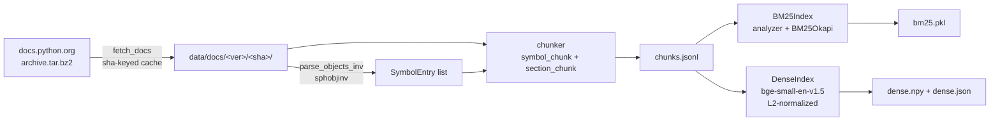
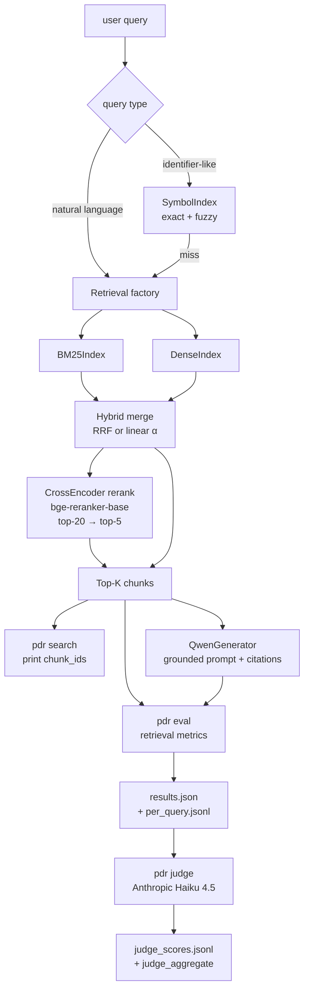

# python-doc-assistant

A Python documentation RAG assistant built from scratch — pinned corpus,
12-configuration retrieval ablation, grounded generation with citations,
HyDE-augmented dense retrieval, a typo-tolerant query rewriter, and a
rubric-calibrated LLM-as-judge for answer-quality evaluation. Every
eval run is replayable bit-for-bit against the same corpus.

**v0** retrieval baseline → **v1** grounded `Qwen2.5-1.5B-Instruct`
generation → **v2** dense / hybrid / rerank ablation + LLM-as-judge +
cross-generator follow-up → **v4** production accuracy track on
`Qwen2.5-7B-Instruct Q4_K_M GGUF` via `llama.cpp` (Metal), refusal
calibration, code-level typo rewriter, HyDE retriever. All four stages
shipped with narrative + run snapshots.

## Headline results

`eval_sets/v2_full.jsonl`, n=111 queries.

### v4 production stack (Qwen 7B Q4 GGUF, Codex CLI judge)

| Stage | Pipeline | Recall@5 | accuracy | halluc |
|---|---|---:|---:|---:|
| v2 baseline (Qwen 1.5B) | dense+rerank | 0.838 | 0.793 | 0.063 |
| v4 R1 calibrated | dense+rerank | 0.829 | 0.775 | 0.009 |
| v4 + rewriter | dense+rerank | 0.829 | 0.829 | 0.009 |
| **v4 + rewriter + HyDE** | dense+rerank+HyDE | **0.856** | **0.874** | **0.009** |

`accuracy = (correct + partial) / n`. **Bold** = current production
stack. v4 shipped numbers exceed the original `accuracy ≥ 0.78` /
`hallucination ≤ 0.10` plan targets with margin.

### v2 retrieval ablation (Qwen 1.5B, Haiku 4.5 judge — historical)

| Configuration | Recall@5 | accuracy | halluc | correct |
|---|---:|---:|---:|---:|
| `symbol+bm25` × Qwen 1.5B (v0 baseline) | 0.730 | 61.3% | 25.2% | 18.9% |
| `dense` × Qwen 1.5B                     | 0.811 | 67.9% | 21.1% | 11.0% |
| `hybrid-rrf` × Qwen 1.5B                | 0.775 | 67.6% | 21.6% | 16.2% |
| `hybrid-linear α=0.3` × Qwen 1.5B       | 0.802 | 69.1% | 22.7% | 12.7% |
| `hybrid-rrf + rerank` × Qwen 1.5B       | 0.829 | 66.7% | 21.6% | 8.1% |
| `dense + rerank` × Qwen 1.5B            | **0.838** | 68.5% | 21.6% | 6.3% |
| `dense + rerank` × GPT-5.5 (v2 §9 follow-up) | 0.829 | 75.7% | 2.7% | 37.0% |

The v2 row absolute numbers shifted under the Codex CLI judge re-pass
(see `experiments/v4-prod-track.md` Week 3). The v2 ablation deltas
across configurations remain valid since the same Haiku bias applied
uniformly.

## Four findings worth noting

1. **Retrieval and generation winners diverge across the Qwen rows.**
   Best Recall@5 is `dense+rerank` (0.838); best accuracy is
   `hybrid-linear α=0.3` (69.1%); best correct_rate is `symbol+bm25`
   (18.9% — the v0 baseline).
2. **Hallucination clusters at 21-23% across all five dense / hybrid
   configs on Qwen 1.5B.** Switching retrieval algorithm barely moves
   hallucination — a strong signal that the generation-side ceiling,
   not retrieval, is the next bottleneck on a small generator.
3. **Rerank delivers +2.7 pp Recall@5 but 0 pp accuracy on Qwen 1.5B.**
   Cross-encoder reordering elevates broader `section_chunk`s; the
   1.5B model then prefers them over precise `symbol_chunk`s.
   `correct_rate` even *drops* −4.7 pp on `dense → dense+rerank`.
4. **Switching the generator collapses the hallucination plateau.**
   On the same `dense+rerank` retrieval, replacing Qwen 1.5B with
   GPT-5.5 drops `hallucination_rate` from 21.6% to 2.7% (≈8×) and
   raises `correct_rate` from 6.3% to 37.0% (≈6×). The
   generation-side ceiling identified in finding 2 is not theoretical
   — it is the dominant constraint at the v2 retrieval ceiling.

Full ablation tables, cross-generator follow-up, and v4 priority
hand-off: [`experiments/v2-ablation.md`](experiments/v2-ablation.md).
Per-stage narratives:
[`experiments/v0-bm25-only.md`](experiments/v0-bm25-only.md),
[`experiments/v1-qwen-grounded.md`](experiments/v1-qwen-grounded.md).

---

## Why these decisions

**Pin the corpus by sha.** The Python docs archive is downloaded once
under `data/docs/<version>/<sha_short>/` and `pdr ingest` errors out on
any sha mismatch. Every `results.json` snapshots the full ingest
manifest. An eval run from week 1 always replays against the exact
same chunks, embeddings, and BM25 index it was measured against — no
silent corpus drift, no "the docs site updated" excuses.

**Build an ablation matrix, not a single config.** v2 runs 12 retrieval
configurations on the same 111-query eval set: BM25 / symbol+BM25 /
dense / hybrid-RRF / hybrid-linear at 5 α values / *+rerank pairs.
That's how the surprising findings above surface. A "best config"
single-shot would never reveal that rerank fails to help generation.

**LLM-as-judge with kappa-calibrated agreement, not vibes.** v2 §6
inter-rater agreement check on 15 stratified samples vs. manual scores
yields exact-match 73.3% / Cohen's kappa 0.645 (substantial agreement,
not the 80% rule-of-thumb plan bar but defensible for delta analysis).
Methodology + four-tier rubric documented; deltas across configs use
the same systematically-biased judge so cross-config comparisons stay
valid even if absolute numbers shift.

---

## Quick start

```bash
# v0 install: ingest + retrieval, no torch
uv sync --extra dev --extra ingest --extra retrieval

# Download Python 3.12 docs archive (~50 MB, sha-keyed cache)
uv run pdr ingest --version 3.12

# Parse symbols + chunk HTML + persist chunks.jsonl + bm25.pkl
uv run pdr build-index

# Search (v0 retrieval)
uv run pdr search "Path.read_text" --k 5
uv run pdr search "how to iterate dict safely" --k 5 --debug

# v0 retrieval-only eval
uv run pdr eval --set eval_sets/v0_core.jsonl --tag v0-bm25
```

For v1 (grounded generation) and v2 (dense / hybrid / rerank):

```bash
# v1+ install: add generation, embedding, rerank, judge extras
uv sync --extra dev --extra ingest --extra retrieval \
  --extra generation --extra embedding --extra rerank --extra judge

# Build dense embedding index (sentence-transformers, BAAI/bge-small-en-v1.5)
uv run pdr build-index --with-dense

# v2 retrieval ablation (12 configs against v2_full)
uv run pdr eval --set eval_sets/v2_full.jsonl --retriever symbol+bm25 --tag v2-bm25
uv run pdr eval --set eval_sets/v2_full.jsonl --retriever dense --tag v2-dense
uv run pdr eval --set eval_sets/v2_full.jsonl --retriever hybrid-rrf --tag v2-hybrid-rrf
uv run pdr eval --set eval_sets/v2_full.jsonl --retriever hybrid-linear --alpha 0.3 --tag v2-a03
uv run pdr eval --set eval_sets/v2_full.jsonl --retriever dense --rerank --tag v2-dense-rerank

# v1/v2 generation: layer Qwen2.5-1.5B-Instruct grounded prompt on top of any retriever
uv run pdr eval --set eval_sets/v2_full.jsonl --retriever dense --rerank \
  --model Qwen/Qwen2.5-1.5B-Instruct --tag v2-dense-rerank-qwen

# v2 §6 LLM-as-judge (requires ANTHROPIC_API_KEY)
uv run pdr judge --run-dir experiments/runs/<timestamp>-v2-dense-rerank-qwen
```

### v4 production stack (single-developer local Q&A)

This is the recommended path if you just want a working Python-docs Q&A
assistant on a Mac. Tested on M1 Pro 16 GB; needs ~8 GB peak RAM
(4.7 GB GGUF + ~3 GB KV cache at `n_ctx=8192`).

```bash
# All extras for v4 (generation backend = qwen-gguf via llama-cpp-python)
uv sync --all-extras

# Ingest corpus + build BM25 + dense indexes (one-time, ~3 min on M1)
uv run pdr ingest --version 3.12
uv run pdr build-index --with-dense

# Download Qwen2.5-7B-Instruct Q4_K_M GGUF (~4.7 GB, two shards)
hf download Qwen/Qwen2.5-7B-Instruct-GGUF \
    qwen2.5-7b-instruct-q4_k_m-00001-of-00002.gguf \
    qwen2.5-7b-instruct-q4_k_m-00002-of-00002.gguf \
    --local-dir data/models

# Ask: dense+rerank + typo rewriter + HyDE (the production stack)
uv run pdr ask "how to read a file in python" \
    --backend qwen-gguf \
    --gguf-model data/models/qwen2.5-7b-instruct-q4_k_m-00001-of-00002.gguf
```

Per-query latency on M1 Pro: ~14 s (HyDE adds one short LLM call, then
the grounded answer). The first query of a session pays a ~15 s model
load tax.

To run the full benchmark on the same stack:

```bash
uv run --all-extras pdr eval \
    --set eval_sets/v2_full.jsonl \
    --tag my-eval-run \
    --backend qwen-gguf \
    --gguf-model data/models/qwen2.5-7b-instruct-q4_k_m-00001-of-00002.gguf \
    --retriever dense --rerank --rerank-candidates 20 --k 5 \
    --hyde
```

Per-query metrics by class (identifier / NL / comparison / howto) +
refusal F1 for any judged run:

```bash
uv run python scripts/per_type_metrics.py \
    --run-dir experiments/runs/<timestamp>-my-eval-run
```

### v4 web UI (FastAPI + React)

Same backend as `pdr ask`, served over HTTP behind a React chat UI.
Useful when you want a browser tab or want to share with someone on
your LAN.

Requires Node ≥ 22 (frontend deps), in addition to the v4 production
stack above.

**Dev mode** (Vite hot-reload + FastAPI side-by-side, two terminals):

```bash
# Terminal 1 — FastAPI backend on :8000
uv run --all-extras pdr serve \
    --gguf-model data/models/qwen2.5-7b-instruct-q4_k_m-00001-of-00002.gguf

# Terminal 2 — Vite dev server on :5173 (proxies /api → :8000)
cd frontend
npm install
npm run dev
```

Open [http://localhost:5173](http://localhost:5173). Vite auto-reloads
on frontend file changes; the backend reloads only on restart.

**Production mode** (single port, no Node runtime needed once the
frontend is built):

```bash
# One-time: build the frontend bundle into frontend/dist/
cd frontend
npm install
npm run build
cd ..

# Single command — FastAPI serves both /api/* and the static UI at /
uv run --all-extras pdr serve \
    --gguf-model data/models/qwen2.5-7b-instruct-q4_k_m-00001-of-00002.gguf \
    --host 127.0.0.1 --port 8000
```

Open [http://localhost:8000](http://localhost:8000). The FastAPI app
auto-mounts `frontend/dist/` at `/` when the directory exists.

**Endpoints:**

| Method | Path | Description |
|---|---|---|
| `POST` | `/api/ask` | Body `{"query": "...", "k": 5, "rerank": true, "hyde": true, "model": "qwen-7b-gguf"}` → SSE stream of `token` + `done` events. `model` is optional and falls back to the server default. |
| `GET` | `/api/models` | List of registered models + the server's default; the React UI fetches this on mount and renders a dropdown. |
| `POST` | `/mcp/mcp` | MCP Streamable HTTP transport. Exposes the `ask` tool to MCP-aware clients (Claude Code, Codex CLI). |
| `GET` | `/health` | Liveness check, `{"status": "ok"}`. |
| `GET` | `/` | Static React UI when `frontend/dist/` is mounted. |

**Optional demo models — TinyDocs v3.1 (base + SFT):**

`pdr serve` accepts up to two v3.1 TinyDocs checkpoints (`base` =
FineWeb pretrain only, `SFT` = base + Python docs fine-tune) so the
hand-written 67 M model can be demoed side-by-side with the Qwen 7B
production backend.

The two v3.1 ckpts were trained with **different tokenizers** —
`tokenizer-mix.json` for the FineWeb pretrain, `tokenizer.json` for
the Python-docs SFT — so each ckpt needs the tokenizer it was trained
with, otherwise its token IDs decode to garbage.

```bash
uv run --all-extras pdr serve \
    --gguf-model data/models/qwen2.5-7b-instruct-q4_k_m-00001-of-00002.gguf \
    --tinydocs-ckpt data/checkpoints/run-sft-v32/step_final.pt \
    --tinydocs-tok data/tokenizer/tokenizer-mix.json \
    --tinydocs-base-ckpt data/checkpoints/run-v31/step_final.pt \
    --tinydocs-base-tok data/tokenizer/tokenizer-mix.json
```

The `run-sft-v32/` checkpoint above is the rebuilt SFT (16 epochs over
the larger sft_corpus_v4 dataset, sharing the FineWeb mix tokenizer
with the base ckpt to keep embedding alignment). It produces
docstring-shaped continuations instead of the period-collapse the
original `run-sft-v31` ckpt got stuck in. The original v31 ckpt is
still on disk if you want to demo the failure mode side-by-side.

The header dropdown gains two entries — "TinyDocs v3.1 SFT" and
"TinyDocs v3.1 base" — alongside Qwen. Each model has its own
`asyncio.Lock`, so a slow Qwen call does not block a fast TinyDocs
call. Pass only `--tinydocs-ckpt` (with `--tinydocs-tok`) when you
just want the SFT variant; omit both flags entirely to skip TinyDocs.

The Playground tab is the right place to compare these three:

| prompt | Qwen 7B | TinyDocs base | TinyDocs SFT (v32) |
|---|---|---|---|
| `Once upon a time` | coherent short story | "the world was in a state of chaos…" (cycles) | "the world was full of people…" (cycles, FineWeb style preserved) |
| `pathlib.Path.read_text` | real signature + body | mostly word-salad | "(path=None, **kwargs) read-only. The return value is a file-like object containing the text of the file…" — plausible-looking docstring (facts hallucinated) |

`<unk>` tokens are masked out of the greedy decode so neither v3.1
ckpt locks into a UNK loop, but the underlying 67 M scaling plateau
still bounds output quality — the demo is honest about what 67 M
can and cannot do.

**Use as an MCP tool (Claude Code / Codex CLI / Claude Desktop):**

Once `pdr serve` is running, register the MCP endpoint in your client.
Config differs per client because Claude Desktop only speaks stdio
while Claude Code / Codex CLI also speak Streamable HTTP.

Claude Code / Codex CLI (HTTP transport, direct):

```json
{
  "mcpServers": {
    "python-doc-assistant": {
      "url": "http://localhost:8000/mcp/mcp"
    }
  }
}
```

Claude Desktop (stdio only — bridge through `mcp-remote`):

```json
{
  "mcpServers": {
    "python-doc-assistant": {
      "command": "npx",
      "args": ["-y", "mcp-remote", "http://localhost:8000/mcp/mcp"]
    }
  }
}
```

The server exposes a single tool — `ask(query, k=5, rerank=true,
hyde=true)` — that runs the same retrieve → rewrite → generate
pipeline as `/api/ask` and returns a markdown answer with a Sources
section linking to docs.python.org. The MCP tool calls and `/api/ask`
share the same Llama instance, queued behind a single asyncio.Lock.

`pdr serve --help` lists every flag (retriever / rerank / HyDE / port
/ host / frontend-dist).

The server holds a single QwenGGUFGenerator + retrieve_fn for the
process lifetime. Concurrent /api/ask requests serialise behind an
`asyncio.Lock` because llama-cpp-python's `Llama` is not thread-safe;
two simultaneous clients queue rather than racing.

---

## Architecture

### Build-time pipeline (`pdr ingest` + `pdr build-index`)



### Query-time pipeline (`pdr search`, `pdr eval`, `pdr judge`)



Every artifact (docs / chunks / indexes / eval runs) is keyed by docs
`major.minor` + archive `sha256` short, so old eval runs always replay
against the exact corpus they were measured against.

---

## Tools and libraries

| Layer | Choice | Why |
| ----- | ------ | --- |
| Dependency manager | [`uv`](https://github.com/astral-sh/uv) + `pyproject.toml` + `uv.lock` | Reproducible environments without `requirements.txt`. |
| Build backend | `hatchling` | PEP 621 compliant, src-layout friendly. |
| CLI | `click` | Standard, composable subcommand pattern. |
| HTML parsing | `beautifulsoup4` + `lxml` | Proven, fast, predictable. |
| Sphinx inventory | `sphobjinv` | Reads `objects.inv` symbol → URI maps cleanly. |
| HTTP | `requests` | Streaming download with retry. |
| BM25 | `rank_bm25` | Lightweight, no Elasticsearch dependency. |
| Fuzzy matching | `rapidfuzz` | C-backed `fuzz.ratio` for SymbolIndex.fuzzy. |
| Dense embedding | `sentence-transformers` (`BAAI/bge-small-en-v1.5`, 384-dim) | v2 §1; L2-normalized, cosine == inner product. |
| Cross-encoder reranker | `sentence-transformers.CrossEncoder` (`BAAI/bge-reranker-base`) | v2 §3; top-20 → top-5 rerank. |
| Generation backend (v1/v2) | `transformers` (`Qwen/Qwen2.5-1.5B-Instruct`) on Mac MPS | v1 §2; greedy decoding, max_new_tokens=512. |
| Generation backend (v4) | `llama-cpp-python` + `Qwen2.5-7B-Instruct-Q4_K_M.gguf` on M1 Metal | v4 sub-task 3'; same `Generator` ABC as v1, n_ctx=8192, temperature=0. |
| LLM-as-judge (v2 historical) | `anthropic` (`claude-haiku-4-5-20251001`) | v2 §6; 4-tier rubric + Cohen's kappa. Bias documented in `experiments/v4-prod-track.md` Week 3. |
| LLM-as-judge (v4 final) | Codex CLI internal LLM (GPT-5.5) | v4 Week 3; same prompt hash `65fa23b9`, rubric-faithful re-evaluation. |
| HTTP server (v4) | `fastapi` + `uvicorn` + `sse-starlette` | v4 sub-task 7; `pdr serve` exposes `/api/ask` (SSE stream) + `/health` + static frontend mount. |
| MCP (v4) | `mcp` (official Anthropic SDK, FastMCP API) | v4 sub-task 10; `/mcp/mcp` Streamable HTTP transport exposes the `ask` tool. Clients: Claude Code, Codex CLI. |
| Web UI (v4) | React 19 + Vite 6 + TypeScript + Tailwind 3 + react-markdown | v4 sub-task 9; single-page chat in `frontend/`. Native `fetch` + `ReadableStream` for SSE (EventSource cannot do POST). |
| Lint + format | `ruff` (E / F / I rules) | Replaces black + isort + flake8. |
| Type checking | `mypy --strict` | Catches API drift early; `py.typed` marker for downstream consumers. |
| Test runner | `pytest` (+ `CliRunner` for CLI tests) | Hermetic; no real network. |
| Optional extras | `pyproject.toml` extras: `ingest`, `retrieval`, `generation`, `embedding`, `rerank`, `judge`, `service` | v0 installs only `ingest` + `retrieval`; later stages opt-in. v4 web UI uses `service`. |

---

## Stage roadmap

| Stage | Deliverable | Plan | Status |
| ----- | ----------- | ---- | ------ |
| **v0** | Retrieval + evaluation: ingest, chunker, BM25 + symbol index, router, CLI, eval set, metrics, run writer | [`plans/v0-retrieval-eval.md`](plans/v0-retrieval-eval.md) | ✅ Recall@5 = 0.730 on `symbol+bm25` (n=111) |
| **v1** | `Qwen2.5-1.5B-Instruct` as a grounded generator with citations + refusal; out-of-scope eval set | [`plans/v1-qwen-generator.md`](plans/v1-qwen-generator.md) | ✅ Grounded prompt + 4-tier scoring shipped |
| **v2** | Ablation: dense embeddings + hybrid (RRF / linear) + cross-encoder rerank, eval set scaled to 111 queries, LLM-as-judge with kappa-calibrated rubric, cross-generator follow-up | [`plans/v2-ablation.md`](plans/v2-ablation.md) | ✅ Recall@5 = 0.838 on `dense+rerank`; accuracy 61-69% on Qwen 1.5B configs, 75.7% on GPT-5.5; halluc 2.7-25.2% |
| **v3** | (Research side track) Hand-written decoder-only LLM (RoPE / RMSNorm / SwiGLU / KV cache) plugged into the same RAG pipeline as a comparison backend | [`plans/v3-tiny-llm.md`](plans/v3-tiny-llm.md) | Research; no accuracy claim — learning value only |
| **v4** | Production-track accuracy lift on a Qwen-only path: 7B Q4 GGUF backend (`llama.cpp` + Metal), refusal calibration, code-level typo query rewriter (Levenshtein-based), HyDE retriever, judge re-evaluation (Haiku 4.5 → Codex CLI / GPT-5.5), HTTP server + React web UI + MCP tool endpoint | [`plans/v4-prod-ready.md`](plans/v4-prod-ready.md), [`experiments/v4-prod-track.md`](experiments/v4-prod-track.md) | ✅ accuracy 0.874 / hallucination 0.009 (n=111, Codex-judged); plan target `≥ 0.78` / `≤ 0.10` exceeded with margin. CLI + FastAPI/React UI + MCP all ship. |

Top-level project plan: [`PLAN.md`](PLAN.md). Per-stage plans are the
authoritative source for sub-task ordering, acceptance criteria, and
deliverables.

---

## Repository layout

```
python-doc-assistant/
├── PLAN.md                         # Top-level project plan
├── AGENTS.md                       # Cross-agent rules (Codex / Claude)
├── CLAUDE.md                       # Claude-specific guidance
├── README.md                       # this file
├── pyproject.toml                  # deps + tool config
├── uv.lock                         # pinned versions
├── config.toml                     # DOCS_VERSION = "3.12"
├── plans/                          # per-stage plans
├── eval_sets/
│   ├── v0_core.jsonl               # 34 hand-written queries (v0)
│   ├── v1_out_of_scope_20.jsonl    # 20 OOS queries (v1)
│   └── v2_full.jsonl               # 111 queries (v0_core + 77 new for v2)
├── experiments/
│   ├── v0-bm25-only.md             # v0 narrative
│   ├── v1-qwen-grounded.md         # v1 narrative
│   ├── v2-ablation.md              # v2 narrative
│   ├── v4-prod-track.md            # v4 narrative (Codex-judged)
│   └── runs/<ts>-<tag>/            # machine-readable run snapshots
├── data/                           # gitignored: docs / chunks / indexes / GGUF models
├── scripts/
│   ├── triage_failures.py          # bucketise judged rows by tier × hit_at_5
│   └── per_type_metrics.py         # v4 sub-task 5b/c: per query_type breakdown + refusal F1
├── frontend/                       # v4 sub-task 9 — React + Vite + TS + Tailwind chat UI
│   ├── package.json
│   ├── vite.config.ts              # Vite config; /api proxy to :8000 in dev
│   ├── eslint.config.js / .prettierrc.json
│   └── src/
│       ├── App.tsx / main.tsx
│       ├── components/             # ChatBox / MessageList / MessageBubble / Citation / HeaderBar
│       ├── hooks/useAsk.ts         # POST /api/ask + parse SSE byte stream
│       ├── lib/remarkCiteMarker.ts # markdown plugin: style [N] / [N, M] inline markers
│       └── types.ts                # mirrors backend AskRequest / DonePayload schemas
└── src/python_doc_assistant/
    ├── ingest/
    │   ├── fetch_docs.py           # download + sha-key + manifest
    │   ├── parse_objects_inv.py    # SymbolEntry list
    │   └── chunker.py              # symbol_chunk + section_chunk
    ├── indexes/
    │   ├── symbol_index.py         # exact + fuzzy multi-candidate
    │   ├── bm25_index.py           # analyzer + BM25Okapi + persistence
    │   └── dense_index.py          # v2 §1: bge-small embeddings + numpy
    ├── retrieval/
    │   ├── router.py               # identifier vs NL dispatch
    │   ├── hybrid.py               # v2 §2: RRF + linear merge
    │   ├── rerank.py               # v2 §3: cross-encoder reranker
    │   ├── factory.py              # build retriever from CLI flags
    │   ├── query_rewriter.py       # v4 sub-task 1': Levenshtein typo rewriter
    │   └── hyde.py                 # v4 sub-task 2: HyDE retriever wrapper
    ├── generation/
    │   ├── interface.py            # v1 §2: Generator ABC
    │   ├── qwen_backend.py         # v1 §2: Qwen2.5-1.5B-Instruct (HF transformers)
    │   └── qwen_gguf_backend.py    # v4 sub-task 3': Qwen2.5-7B-Instruct Q4_K_M GGUF backend
    ├── prompts/
    │   └── grounded.py             # v1: grounded prompt template + citation parser + REFUSAL_MARKER
    ├── evaluation/
    │   ├── dataset.py              # eval set schema + JSONL loader
    │   ├── retrieval_metrics.py    # is_hit + Recall@K + MRR
    │   ├── run_writer.py           # results.json + per_query.jsonl
    │   ├── generation_eval.py      # v1 §4: per-query generation pipeline
    │   ├── human_scoring.py        # v1 §6: 4-tier scoring schema + aggregate
    │   └── judge.py                # v2 §6: LLM-as-judge (Anthropic Haiku 4.5)
    ├── service/                    # v4 sub-task 7 + 10: HTTP server + MCP
    │   ├── streaming.py            # SSE event helpers (token / done / error)
    │   ├── app.py                  # FastAPI build_app + /api/ask + /health + /mcp mount + lifespan
    │   └── mcp.py                  # FastMCP server with `ask` tool over Streamable HTTP
    └── cli.py                      # pdr ingest / build-index / search / ask / eval / judge / serve
```

---

## Development

```bash
uv sync --extra dev --extra ingest --extra retrieval

# Lint + format
uv run ruff check .
uv run ruff format .

# Type-check
uv run mypy src tests

# Run all tests (218 hermetic; no network)
uv run pytest
```

`tests/` mirrors `src/` with one test module per source file. Tests
mock HTTP via `monkeypatch`, build small in-memory tarballs / HTML
fixtures, and use `tmp_path` for filesystem isolation. None of them
read real docs or real `objects.inv`.

---

## Reproducibility

Every eval run is written to `experiments/runs/<ISO-timestamp>-<tag>/`
with two files:

| File | Contents |
| ---- | -------- |
| `results.json` | aggregate retrieval metrics (Recall@5 / Recall@10 / MRR / n_queries) + 7 reproducibility fields (`docs_version`, `docs_served_version`, `docs_sha_short`, full `ingest_manifest` snapshot, `config`, `tag`, `command`); for generation runs adds `model` + `decoding_params`; for judged runs adds `judge` (model + prompt hash + timing) and `judge_aggregate` (tier counts + hallucination_rate + correct_rate). |
| `per_query.jsonl` | one line per EvalQuery: retrieved chunk_ids + scores + ranks + hit flags + rank_for_mrr; generation runs also include `model_output_text`, `cited_chunk_ids`, `refused`. |
| `judge_scores.jsonl` | (v2 §6 only) one `JudgeRecord` per query: tier (correct / partial / wrong / hallucination / refused), notes, raw judge output, judge_model, judge_prompt_hash, timestamp. |

The `<docs_sha_short>` directory under `data/docs/<version>/` is never
overwritten by re-ingest — `pdr ingest` errors out on sha mismatch
unless `--force-switch` is passed and creates a new sibling
directory. Old runs always resolve back to the corpus they were
measured against.

---

## Constraints (not goals)

- **Framework-light.** No LangChain, LlamaIndex, hosted vector DBs, or
  general orchestration frameworks. Direct stdlib + targeted libraries
  only.
- **Evaluation-first.** Eval set design (`eval_sets/v0_core.jsonl`)
  precedes retrieval optimization. Failing queries are data signals
  for the next stage, not bugs to "fix" by adjusting expected values.
- **Stage-isolated dependencies.** v0 deliberately does not install
  `torch` / `transformers` / `sentence-transformers` / `anthropic`. They
  land in v1+ via `pyproject.toml` extras (`generation`, `embedding`,
  `rerank`, `judge`).
- **Reproducible per-run.** Docs version pinned via `DOCS_VERSION`;
  archive sha-keyed; manifest snapshotted into every eval result. No
  silent corpus drift between runs.

---

## What this project taught me

- **Reproducibility costs almost nothing if it's designed in from
  step 0** (sha-keyed corpus + manifest snapshot per run) and pays
  back constantly once you start iterating. Every "wait, what config
  was that under?" question becomes a `cat results.json` lookup.
- **Ablation matrices reveal lies that single-best-config doesn't.**
  The rerank-helps-Recall-but-not-accuracy finding is invisible
  unless you measure both layers across multiple configs on the same
  eval set.
- **LLM-as-judge has real bias, but consistent bias across configs is
  fine for delta analysis.** Cohen's kappa 0.645 is below the 0.80
  rule-of-thumb but the cross-config comparisons stay valid because
  the bias direction is the same everywhere.
- **The generator dominates the ceiling.** A 1.5B Instruct model has
  a ~21% hallucination floor on Python doc queries no matter how
  good the retrieval is — meaning further retrieval optimization is
  a low-leverage move at this generator size, and the next high-ROI
  step is upgrading to a larger / API-grade model.
- **Type hints + small, testable modules > frameworks.** 250+ tests
  cover the codebase end-to-end with no real network and no real
  models loaded. Adding dense indexing or reranking touched < 5
  files each because the seams were already in place.

## What's next

v4 closed with accuracy 0.874 / hallucination 0.009, both past plan
targets. The Qwen-only path is production-ready as a single-developer
local CLI **and** as a single-port FastAPI / React web UI. Possible v5
directions, none currently active:

- **Eval set with explicit `out_of_scope` rows** so refusal F1 is a
  meaningful metric (currently it falls back to `hit_at_5`-proxy F1
  because `v2_full` has no OOS labels).
- **Real token-by-token streaming** in `pdr serve` — the current SSE
  stream emits the full answer in one `token` event (fake-stream).
  Wiring `Llama.create_chat_completion(stream=True)` through to the
  SSE generator gives per-token output for free.
- **Multi-user concurrency** — the FastAPI server serialises
  `/api/ask` behind an `asyncio.Lock` because llama-cpp's `Llama` is
  single-stream. A 2nd client waits ~13 s for the 1st to finish.
  Multi-instance pool or vLLM if shared use is needed.
- **v3 (research side track)**: hand-written decoder-only tiny LLM
  (RoPE / RMSNorm / SwiGLU / KV cache) as a Generator backend
  alongside Qwen — purely for learning the architecture end-to-end,
  no accuracy goal. Plan: [`plans/v3-tiny-llm.md`](plans/v3-tiny-llm.md).

---

## License

MIT — see [`LICENSE`](LICENSE).
