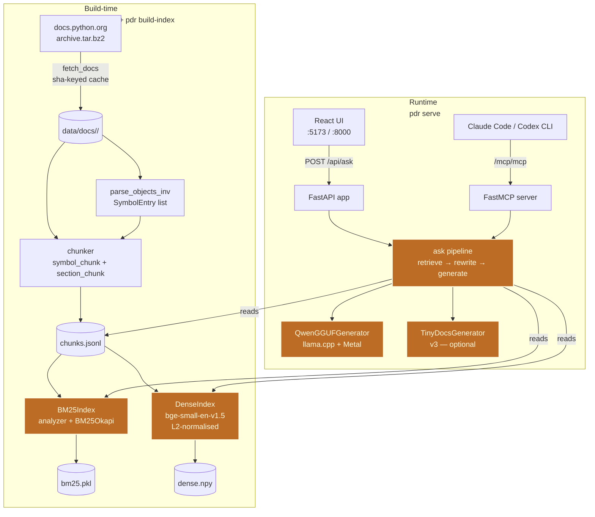
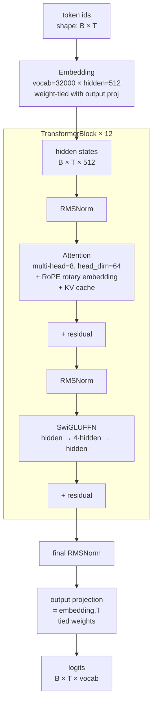
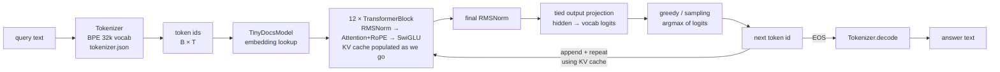

# python-doc-assistant — Summary (English)

A from-scratch Python documentation RAG assistant. v0 → v4 ships a
production stack on Qwen 7B Q4 GGUF; v3 is a research side-track that
trains a 67 M decoder-only model from scratch and plugs it in as a
swappable generator.

---

## 1. Architecture (v4 production / Qwen path)

**Highlighted nodes (burnt-orange) = the RAG core.** Two indexes (BM25 +
Dense) provide *retrieval*, the `ask pipeline` runs *retrieve →
rewrite → augment → generate*, and the two generators are the *G* in
RAG. Build-time ingestion / chunking and runtime UI/MCP transport are
plumbing around the RAG core, not RAG themselves.

Key invariants:

- **Pinned corpus.** Each docs archive is sha-keyed; eval runs replay
  bit-for-bit against the same chunks/indexes.
- **Generator ABC.** Both Qwen GGUF and TinyDocs implement
  `Generator.generate(query, chunks)`; the rest of the stack does not
  know which backend is active.
- **Single shared state.** A `pdr serve` process holds one
  `AskState` containing all loaded models, the retrieve_fn, the
  chunk lookup, and per-model `asyncio.Lock`s. The same state powers
  `/api/ask` (UI), `/mcp/mcp` (Claude Code), and was used by
  `pdr ask` / `pdr eval` historically.

---

## 2. How an answer is produced

```mermaid
flowchart LR
  Q[user query] --> CLS[router.classify]
  CLS -->|identifier| RAW[query as-is]
  CLS -->|NL / how-to / comparison| HYDE[HyDE: LLM writes a<br/>hypothetical doc passage]:::retrieve
  HYDE --> EMB[hypothetical → embedding]:::retrieve
  RAW --> EMB2[query → embedding]:::retrieve
  EMB --> DENSE[DenseIndex.search<br/>top-20]:::retrieve
  EMB2 --> DENSE
  DENSE --> RERANK[CrossEncoder rerank<br/>scored against ORIGINAL query<br/>top-20 → top-5]:::retrieve
  RERANK --> REW[query_rewriter<br/>Levenshtein typo fix<br/>against top-K symbols]:::retrieve
  REW --> PROMPT[grounded prompt<br/>system: cite + refuse rules<br/>user: chunks + question]:::augment
  PROMPT --> GEN[Generator.generate<br/>Qwen 7B Q4 / TinyDocs]:::generate
  GEN --> PARSE[parse_response<br/>extract N markers + refusal]:::generate
  PARSE --> ANS[Answer<br/>text + cited_chunk_ids + refused]
  ANS --> SSE[SSE stream<br/>token + done events<br/>with docs.python.org URLs]

  classDef retrieve fill:#606c38,stroke:#fefae0,stroke-width:2px,color:#fefae0;
  classDef augment fill:#dda15e,stroke:#283618,stroke-width:2px,color:#283618;
  classDef generate fill:#bc6c25,stroke:#fefae0,stroke-width:2px,color:#fefae0;
```

**Color legend — the three letters of RAG:**

- 🟢 **R · Retrieve** (olive): `HyDE`, embedding, `DenseIndex.search`,
  `CrossEncoder rerank`, `query_rewriter` — everything that picks
  which chunks the model will see.
- 🟡 **A · Augment** (sand): `grounded prompt` — splices the chosen
  chunks + the rules the model must obey into the LLM's input.
- 🟠 **G · Generate** (burnt): `Generator.generate` + `parse_response`
  — the LLM produces text, then the parser extracts citations and
  the refusal flag.

Everything else (`router.classify`, `Answer`, `SSE stream`) is plumbing
around the RAG triangle.

Stage notes:

1. **Classify.** Heuristic router buckets the query into
   `identifier` / `natural_language` / `comparison` / `howto`. Used
   to pick the prompt structure hint and to gate HyDE.
2. **HyDE (non-identifier only).** The LLM writes a 3–5 sentence
   "hypothetical answer" in documentation form; that text is what
   gets embedded for the dense search. The hypothetical's embedding
   lives near real Python docs even when the user's query does not
   (research cite: Gao et al. 2022). +2.7 pp recall@5 measured on
   v2_full.
3. **Dense retrieval.** `bge-small-en-v1.5` (384-dim, L2-normalised)
   over all chunks; cosine similarity = inner product.
4. **Rerank.** `BAAI/bge-reranker-base` cross-encoder scores
   `(original_query, chunk_text)` pairs and picks the top 5. The
   cross-encoder always sees the **original** query, not the
   hypothetical — its job is to score user intent.
5. **Query rewriter.** Compares the query to each retrieved symbol
   chunk's symbol; if exactly one symbol is within Levenshtein
   distance 2 (case-insensitive, with disambiguation guard), the
   query is rewritten to that symbol before it goes into the prompt.
   Fixes typo queries like `subprocess.runn` → `subprocess.run`
   without prompt-coaching hallucinations.
6. **Generate.** Grounded prompt with hard rules ("every factual
   sentence ends with a `[N]` citation; refuse only when chunks are
   completely unrelated"). Greedy decoding, temperature 0.
7. **Parse.** Pulls `[N]` (and `[N, M]`) markers out, maps back to
   chunk_ids. Refusal marker `[INSUFFICIENT-CONTEXT]` flips
   `Answer.refused = True`.
8. **Stream.** `_ask_stream` yields a `token` event with the full
   text (fake-stream MVP) then a `done` event with cited chunks +
   their `docs.python.org` URLs + which model answered.

End-to-end latency on M1 Pro: ~14 s/query for Qwen 7B Q4 (HyDE adds
~2 s; the rest is dense + rerank + generation).

---

## 3. TinyDocs model architecture (v3 research side-track)

A from-scratch decoder-only transformer, ~67 M parameters, modelled
on Llama 2's recipe. No HuggingFace weights, no transformers library
shortcuts — every block is hand-written in pure PyTorch.

Component roles:

- **Embedding (& tied output projection).** Maps token id → 512-dim
  vector. The embedding matrix is **shared** with the output
  projection: `logits = hidden @ embedding.T`. Cuts parameter count
  roughly in half on the input/output edges.
- **RMSNorm.** Root-mean-square layer norm — divides each token
  vector by its RMS, then multiplies by a learnable scale. Cheaper
  than LayerNorm (no mean subtraction, no bias). Llama-style.
- **Attention.**
  - Q / K / V are 3 separate `nn.Linear(hidden, hidden)` projections.
  - Heads = 8 × head_dim = 64.
  - **RoPE** (Rotary Positional Embedding) rotates the Q and K
    vectors by an angle proportional to the position; relative
    position becomes a dot-product property without explicit
    position embeddings.
  - **KV cache** stored at inference: token `t`'s K/V never need
    recomputation when generating token `t+1`.
  - Causal mask: token `t` only attends to tokens `≤ t`.
- **SwiGLUFFN.**
  `swish(x · W_gate) ⊙ (x · W_up) → W_down`. Llama 2 / 3's FFN
  block. Two parallel projections gated elementwise, then a
  down-projection. Same parameter budget as a 2-layer MLP, but
  better empirically.
- **TransformerBlock.** Pre-norm: norm → attention → residual →
  norm → FFN → residual. Identical recipe in every layer.
- **Output projection.** Tied to embedding. The model emits
  `logits[t]` for the next token's distribution; greedy sampling
  picks the argmax.

Parameter budget at vocab=32000, hidden=512, layers=12, heads=8:

| Component | Params (approx) |
|---|---:|
| Embedding (tied) | 32000 × 512 ≈ 16.4 M |
| Per layer (attention + FFN + 2 norms) | ~4.2 M |
| 12 layers | ~50.4 M |
| Final norm + tied head | tiny |
| **Total** | **~67 M** |

---

## 4. TinyDocs end-to-end flow (tokenizer → generator)

Stage notes:

1. **Tokenize.** A BPE tokenizer (vocab 32000, trained from the
   pretrain mix of CPython docs + sft prompts) maps the prompt to
   integer ids. Same tokenizer used at training and inference.
2. **Embedding lookup.** Each id picks a row from the 32000 × 512
   embedding matrix.
3. **Forward through 12 blocks.** Each block: RMSNorm → multi-head
   attention with RoPE → residual → RMSNorm → SwiGLU FFN → residual.
   On the **first** forward pass during inference the full prompt
   goes through; KV cache fills with all positions.
4. **Final RMSNorm + tied output projection.** Produces logits over
   the vocab for every position. Only the last position is needed
   for next-token sampling.
5. **Sample.** Greedy by default in v3.1 SFT (temperature 0 →
   `argmax`).
6. **Append + reuse KV cache.** New token is fed back as a single
   position; the existing KV cache means the rest of the model only
   processes that one new step. Repeat until EOS or `max_new_tokens`.
7. **Detokenize.** `tokenizer.decode(ids)` collapses BPE pieces back
   to text.

The same `Generator.generate(query, chunks)` ABC method wraps all of
that, so the v4 RAG pipeline can call TinyDocs with the exact same
calling convention as Qwen GGUF.

---

## 5. Tech across v0 → v4

| Stage | Tech | What it does | Why we need it |
|---|---|---|---|
| **v0** | `pdr ingest` (HTTP fetch + sha-keyed cache) | Downloads docs.python.org tar.bz2 archive once, caches by sha256 | Pinned corpus → reproducible eval runs |
| v0 | `parse_objects_inv` (sphobjinv) | Reads Sphinx `objects.inv` to extract canonical (symbol, URL) pairs | Authoritative symbol → URL map; the source of truth for "is this a real Python symbol?" |
| v0 | Chunker (BeautifulSoup + lxml) | Two-pass HTML → `symbol_chunk` (per-API) and `section_chunk` (per-tutorial section) | Right granularity for retrieval — too big = imprecise, too small = no context |
| v0 | **BM25Index** (rank_bm25) | Lexical retrieval: tokenises chunks, scores each candidate by term-frequency / inverse-document-frequency | Fast, no GPU, strong on identifier queries (`json.loads` is a literal token) |
| v0 | **SymbolIndex** (exact + rapidfuzz) | Exact match on canonical symbol name, with fuzzy fallback | When the query is a known Python symbol, skip BM25 entirely |
| v0 | Router | Heuristic: identifier-shaped query → SymbolIndex, NL → BM25 | Different query shapes need different retrievers |
| v0 | EvalQuery + retrieval metrics | Hand-written eval set (n=34); measures Recall@k + MRR | Eval-first: failing queries are signals, not bugs to "fix" |
| **v1** | Grounded prompt + Generator ABC | Chat-template messages: system rules + chunks + question; ABC so backends are swappable | Citations + refusal as a contract, not a hope |
| v1 | Qwen 2.5 1.5B (transformers, MPS) | First grounded generator | Smallest model that follows citation instructions |
| v1 | 4-tier human scoring | correct / partial / wrong / hallucination + refused | Need a tier-level signal, not a single accuracy number |
| **v2** | **DenseIndex** (sentence-transformers `bge-small-en-v1.5`) | Embeds chunks to 384-dim vectors; cosine similarity for retrieval | Catches semantic matches BM25 misses ("how to read a file" ≠ "Path.read_text" lexically) |
| v2 | Hybrid retrieval (RRF + linear blend) | Combines BM25 + dense rankings | Each retriever has different blind spots; fusion catches more |
| v2 | **CrossEncoder rerank** (`bge-reranker-base`) | Re-scores top-20 candidates with `(query, chunk)` pairs | Cross-encoder reads both sides jointly → much higher precision than embedding cosine |
| v2 | LLM-as-judge (Anthropic Haiku 4.5) | Pre-defined rubric scores each (query, output) pair into a tier | Removes humans from the per-run measurement loop |
| v2 | Cohen's kappa calibration | Inter-rater agreement vs. manual scores | Verifies the judge is consistent enough for delta analysis |
| **v3** | **TinyDocs** (hand-written 67M) | Decoder-only transformer trained from scratch (RMSNorm + RoPE + SwiGLU + KV cache) | Learning value — write every block by hand to understand the architecture |
| v3 | BPE tokenizer (tokenizers crate via Python bindings) | 32k vocab from CPython docs + SFT corpus | Aligned with the corpus the model trains on |
| v3 | SFT distillation | Teacher answers from Claude → student fine-tunes on Q&A pairs | Cheap path from pretrain to instruction-following |
| **v4** | Qwen 2.5 7B Q4_K_M GGUF (`llama-cpp-python` + Metal) | Production generator on M1 | Capacity-class quality at consumer-Mac latency (~13 s/query) |
| v4 | Refusal calibration (prompt R1) | Soft "prefer partial over refuse" rule | Lifts accuracy 0.703 → 0.730 with no hallucination cost |
| v4 | **Query rewriter** (Levenshtein, pure code) | Pre-generation: rewrite typo queries to canonical symbol before generator sees them | Beats prompt-only typo coaching (which leaks hallucination) |
| v4 | **HyDE** retriever | LLM writes hypothetical answer; embed that for dense search | Recall@5 0.829 → 0.856; bridges NL-vs-doc-form gap |
| v4 | Codex CLI re-judge | Replaces Haiku 4.5 (rubric-misapplication bias) with GPT-5.5 strict judge | Corrected v4 accuracy 0.773 → 0.874 (Haiku had under-credited correct + mislabeled wrong as hallucination) |
| v4 | Failure triage script | Buckets judged rows by `tier × hit_at_5` | Direct sub-task work to the largest failure mode |
| v4 | Per-type metrics + refusal F1 | Splits accuracy by query_type (identifier / NL / comparison / howto) | Hides what the global aggregate hides |
| v4 | **FastAPI HTTP server** + SSE streaming | `pdr serve` exposes `/api/ask` to the React UI | Multi-client UX, one warm model |
| v4 | **React + Vite + Tailwind** chat UI | Frontend chat with streaming, citation pills, model picker | The "production-ready single-developer tool" deliverable |
| v4 | **MCP server** (FastMCP, Streamable HTTP) | `/mcp/mcp` exposes the `ask` tool to Claude Code / Codex CLI / Claude Desktop (via mcp-remote) | This RAG stack becomes a tool inside any MCP-aware client |
| v4 | Multi-model `AskState` | Per-model `asyncio.Lock`; UI dropdown + MCP `model` arg pick which generator answers | Demoes Qwen 7B vs hand-written 67M side-by-side without restarting the server |

End-of-summary.
